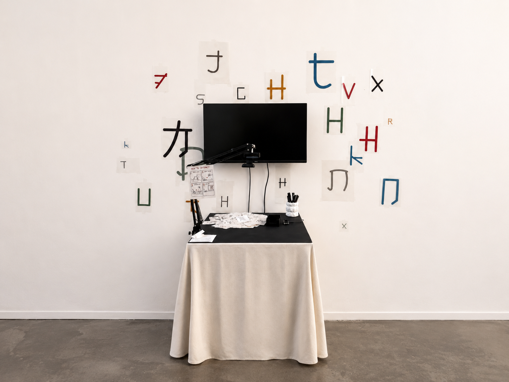
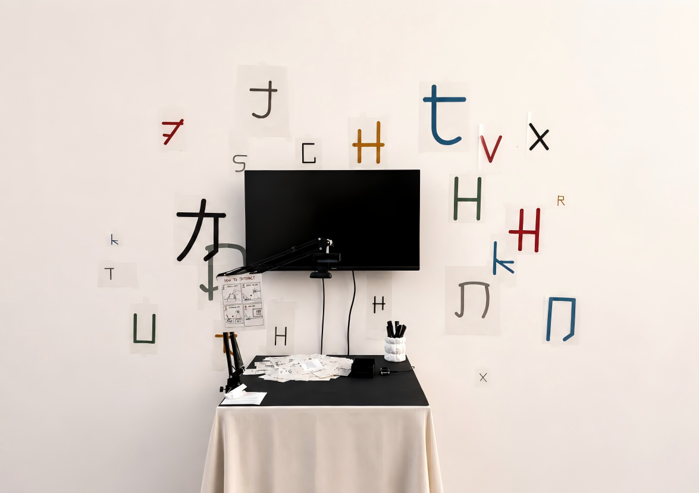
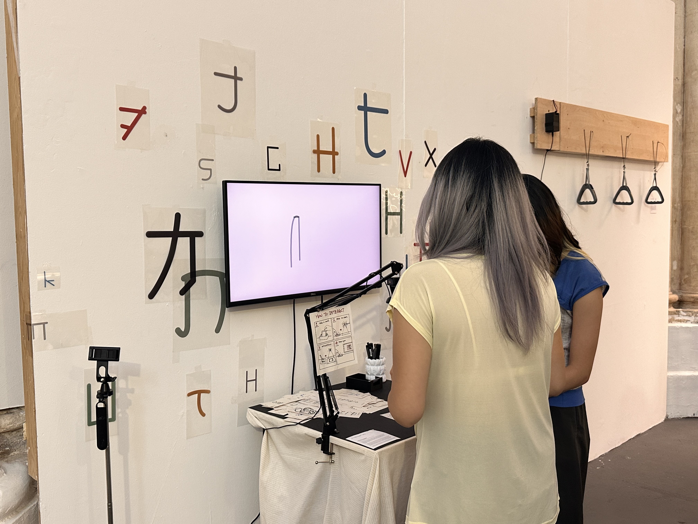
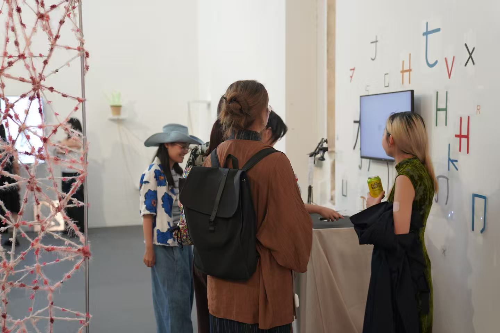
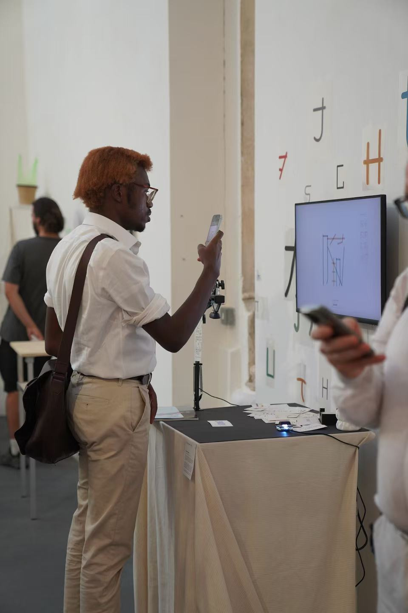
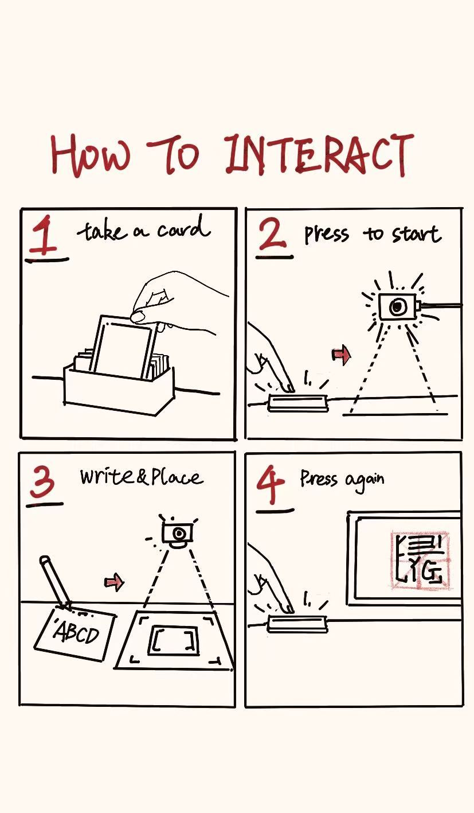

# Name Translator

<p align="center">
  
</p>

<p align="center">
  <strong>An interactive computational art work about names, machine reading, and rule-based visual translation.</strong>
</p>

<p align="center">
  <a href="https://name-translator.onrender.com/exhibition.html">Live exhibition page</a>
</p>

## About

Name Translator explores what happens when a handwritten English name passes through a machine system and returns as a new visual character.

The work begins with a simple visitor action. A person takes a trace card, writes a name, places it under the overhead camera, and presses the physical button. The system reads the handwriting, filters the recognised name, separates it into letter groups, then recomposes those letters into square pseudo-characters inspired by Mi Zi Grid structure and radical-like forms.

The final image is not generated by an image model. Gemini reads the handwriting. The transformation after recognition is a custom JavaScript and p5.js system built from my own A to Z visual mapping, grouping logic, drawing rules, and archive animation.

## Installation View

<table>
  <tr>
    <td width="50%">
      
    </td>
    <td width="50%">
      
    </td>
  </tr>
  <tr>
    <td width="50%">
      
    </td>
    <td width="50%">
      
    </td>
  </tr>
</table>

## How To Interact

<p align="center">
  
</p>

1. Take a trace card.

2. Press the physical button to start.

3. Write a name and place the card inside the camera frame.

4. Press again to submit the trace.

5. Watch the recognised name become a square pseudo-character.

6. The result is stored visually in the Residue Archive before the system returns to waiting mode.

## Interaction Pipeline

```text
Handwritten name
Camera image
Gemini handwriting recognition
Recognised English text
Letter cleaning and grouping
Custom A to Z glyph mapping
Square composition rules
Generated pseudo-character
Residue Archive
Return to waiting mode
```

## Technical Structure

1. The overhead camera captures the handwritten name.

2. The Node.js and Express server receives the captured image.

3. Google Gemini API reads the handwriting through the Google GenAI SDK.

4. Socket.IO sends recognition events between the browser and server.

5. p5.js renders the live writing, generated character, and archive sequence.

6. The A to Z mapping, grouping system, square layout, colour logic, and residue animation are my own rule-based JavaScript system.

Current recognition model:

```text
gemini-3.1-flash-lite
```

Main live page:

```text
https://name-translator.onrender.com/exhibition.html
```

## Local Setup

1. Install Node.js LTS.

2. Install dependencies.

```bash
npm install
```

3. Copy `.env.example` to `.env`.

4. Add your Gemini API key.

```env
GEMINI_API_KEY=your_api_key_here
```

5. Start the local server.

```bash
npm start
```

6. Open the exhibition page.

```text
http://127.0.0.1:3000/exhibition.html
```

## Windows Preview

After running `npm install` and creating `.env`, Windows users can double-click:

```text
START_PREVIEW.bat
```

The script starts the local server and opens the exhibition page in the default browser.

## Render Deployment

Build Command:

```bash
npm install
```

Start Command:

```bash
npm start
```

Environment Variable:

```text
GEMINI_API_KEY
```

Render provides the `PORT` environment variable automatically. The server listens on `0.0.0.0`, so no fixed local port is required for deployment.

## Main Files

1. `server.js`

   Express server, Socket.IO bridge, static file serving, recognition endpoints, and Render-compatible port binding.

2. `recognition.js`

   Google Gemini handwriting recognition wrapper. The API key is read only from `process.env.GEMINI_API_KEY`.

3. `outputs/exhibition.html`

   Main exhibition page.

4. `outputs/exhibition.js`

   Browser-side state flow and interaction logic.

5. `outputs/mi_zi_grid_sketch.js`

   p5.js rendering system for writing, A to Z mapping, square composition, final result, and Residue Archive.

6. `outputs/waiting-scene.js` and `outputs/waiting-scene.css`

   Waiting screen glyph animation and visual layout.

7. `outputs/camera-core.js`

   Camera preview and capture logic.

8. `outputs/vendor/p5.min.js`

   Local p5.js runtime.

## Authorship

The handwriting recognition model is Google Gemini. The interaction design, A to Z visual system, glyph paths, letter grouping, square composition rules, generative rendering, archive behaviour, and interface integration are my own project work.

## Repository Safety

This repository does not include `.env`, API keys, `node_modules`, runtime binaries, logs, or pid files.

`package-lock.json` is included so the project can be installed reproducibly.
