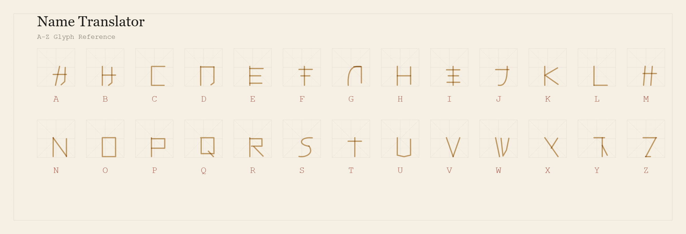
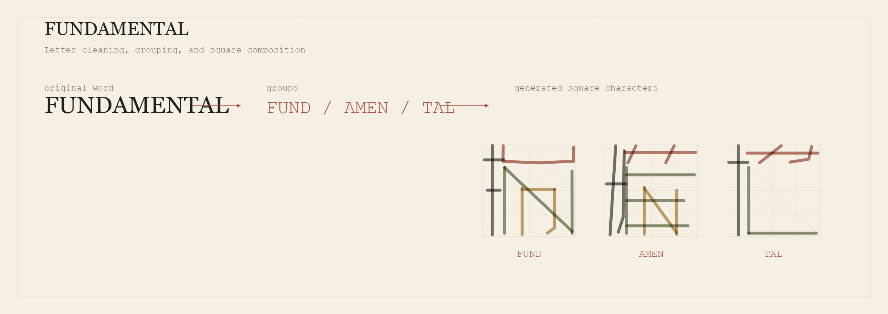
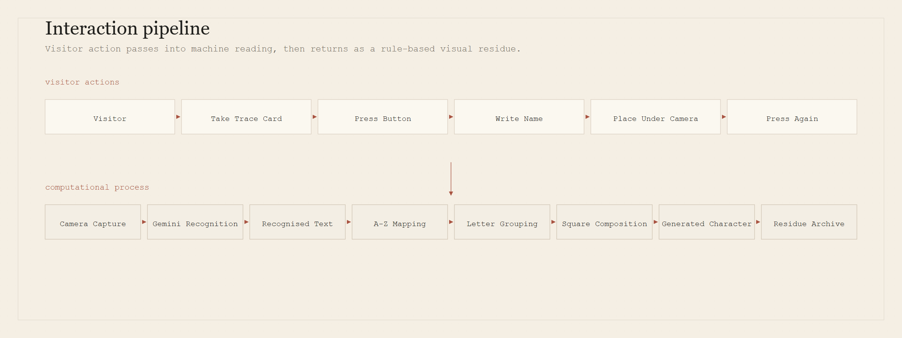

# Name Translator

An interactive computational artwork for handwritten names, machine reading, and rule-based glyph composition.

<p align="center">
  
</p>

<p align="center">
  <a href="https://name-translator.onrender.com/exhibition.html">Open the live exhibition page</a>
</p>

## About

Name Translator began with a simple question: what happens when a handwritten name is read by a machine and rebuilt through a different visual system.

In the installation, a visitor takes a trace card, writes an English name, places it under the overhead camera, and presses the button. The system reads the handwriting, filters the result, splits the name into letter groups, then draws new square pseudo-characters from a fixed A to Z glyph system.

Gemini reads the handwriting. My JavaScript and p5.js system handles the visual transformation.

## Installation View

<p align="center">
  
</p>

<p align="center">
  
</p>

## How To Interact

<p align="center">
  
</p>

1. Take a trace card.

2. Press the physical button to start.

3. Write a name and place the card inside the camera frame.

4. Press again to scan the name and begin the transformation.

5. Watch the recognised name become a square pseudo-character.

6. The result enters the Residue Archive before the system returns to waiting mode.

## Character System

Each English letter has a predefined visual form based on my A to Z mapping. The forms are placed into fixed structural zones inside a square. The final characters are generated from these rules rather than produced by an image-generation model.

<p align="center">
  
</p>

For a word such as `FUNDAMENTAL`, the program cleans the recognised text and groups the letters as `FUND`, `AMEN`, and `TAL`. Each group becomes one generated square character.

<p align="center">
  
</p>

## How the System Works

<p align="center">
  
</p>

1. The visitor writes an English name on a paper trace card.

2. The overhead camera captures the writing area.

3. The Node.js server sends the captured image to Google Gemini for handwriting recognition.

4. The recognised text is cleaned into uppercase A to Z letters.

5. The letters are grouped into square-character units.

6. p5.js draws each group using the project glyph mapping, zone layout, colour rules, and archive animation.

## Development and Iteration

Earlier versions tested pressure sensor input, phone and tablet drawing, serial communication, and different recognition routes. Those tests helped me understand what the interaction needed to feel like, but they also made the technology too visible.

I simplified the final version because the technology was starting to distract from the name itself. The submitted installation returns to paper, camera, and one physical button so the visitor's action stays direct.

## Technical Stack

1. Node.js and Express run the local and deployed server.

2. Socket.IO connects the browser page and the server in real time.

3. Google Gemini API performs the handwriting recognition step.

4. The current recognition model is `gemini-3.1-flash-lite`.

5. The Google GenAI JavaScript SDK package is `@google/genai`.

6. p5.js renders the waiting scene, generated character, and Residue Archive.

7. dotenv loads local environment variables during development.

8. qrcode is used for QR code generation in the server.

## Local Setup

1. Install Node.js LTS.

2. Install dependencies.

```bash
npm install
```

3. Copy `.env.example` to `.env`.

4. Add your own Gemini API key.

```env
GEMINI_API_KEY=your_api_key_here
```

5. Start the local server.

```bash
npm start
```

6. Open the exhibition page.

```text
http://127.0.0.1:3000/exhibition.html
```

## Windows Preview

After running `npm install` and creating `.env`, Windows users can double-click:

```text
START_PREVIEW.bat
```

The script starts the local server and opens the exhibition page in the default browser. It does not contain an API key.

## Main Files

1. `server.js`

   Express server, Socket.IO bridge, static file serving, recognition endpoints, and Render-compatible port binding.

2. `recognition.js`

   Google Gemini handwriting recognition wrapper. The API key is read only from `process.env.GEMINI_API_KEY`.

3. `outputs/exhibition.html`

   Main exhibition page.

4. `outputs/exhibition.js`

   Browser-side state flow, camera capture, button handling, and recognition-result handoff.

5. `outputs/mi_zi_grid_sketch.js`

   p5.js rendering system for the A to Z mapping, square composition, final result, and Residue Archive.

6. `outputs/camera-core.js`

   Shared camera crop, thresholding, and ink-feature analysis.

7. `outputs/waiting-scene.js` and `outputs/waiting-scene.css`

   Waiting screen glyph animation and visual layout.

8. `docs/tools/generate-documentation-figures.js`

   Documentation-only renderer used to create the README diagrams from the current project glyph data, colour data, and structural rules. It mirrors the live project logic for documentation rather than directly exporting frames from the running exhibition page.

## Technical References

See [TECHNICAL_REFERENCES.md](TECHNICAL_REFERENCES.md).

## AI Assistance

See [AI_ASSISTANCE.md](AI_ASSISTANCE.md).

## Authorship

The handwriting recognition model is Google Gemini. The concept, interaction design, A to Z visual mapping, glyph paths, letter grouping, square composition rules, generative rendering, archive behaviour, and interface integration are my own project work.

## Repository Safety

This repository does not include `.env`, API keys, `node_modules`, runtime binaries, logs, or pid files.

`package-lock.json` is included so the project can be installed reproducibly.

<details>
<summary>Render deployment notes</summary>

Build Command:

```bash
npm install
```

Start Command:

```bash
npm start
```

Environment Variable:

```text
GEMINI_API_KEY
```

Render provides the `PORT` environment variable automatically. The server listens on `0.0.0.0`, so no fixed local port is required for deployment.

</details>
